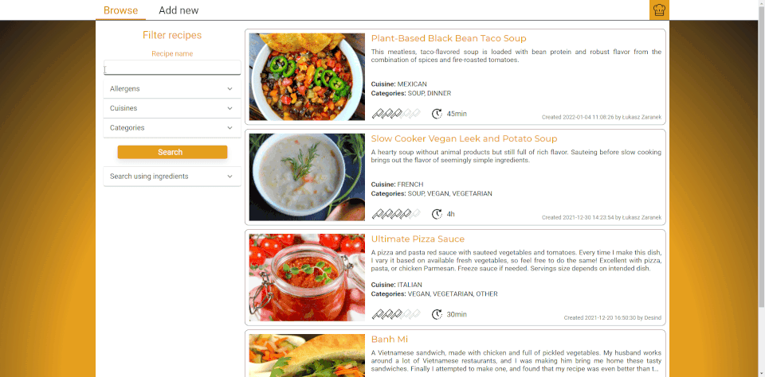
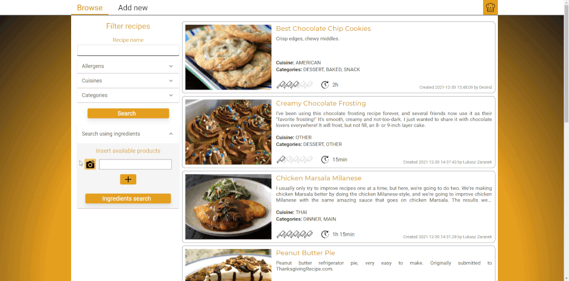

## About

This is an app for managing and sharing recipes with other people with some other cool functionalities.
In this app spring boot + mongoDB server is used. https://github.com/Desind/JustCook-Auth-Server
#### Requirements:
Node.js:
https://nodejs.org/en/

#### Technologies used:
- React.js
- React Router
- react-hooks-global-state
- Material UI
- React Testing Library

# How to start project

To start project type these commands in parent directory
* `yarn install`
* `yarn start`

#Demo
#####Browsing recipes

#####Scanning barcode of a product

#####Show recipe details

#####User profile

#####Creating new recipe

